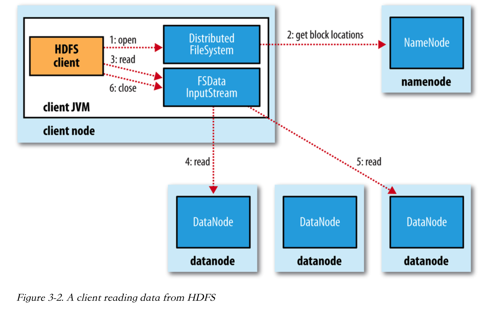
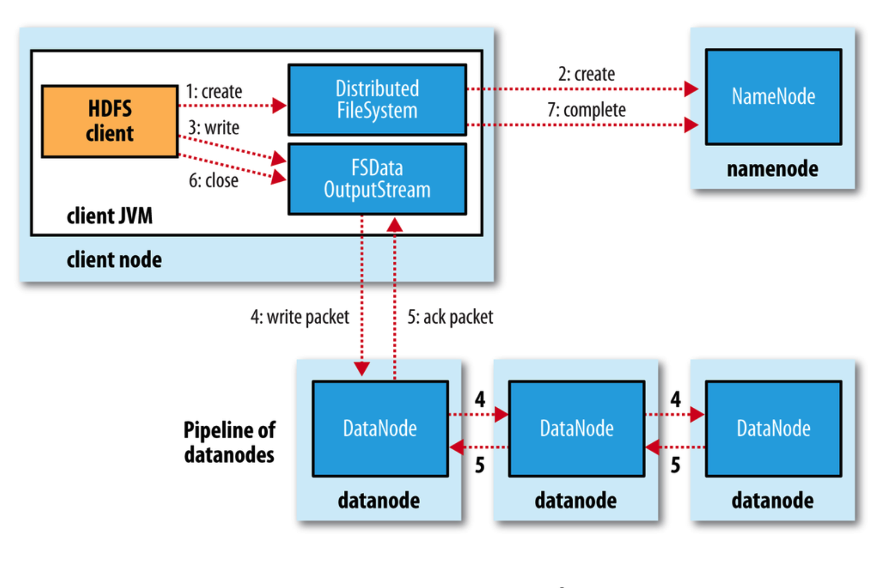
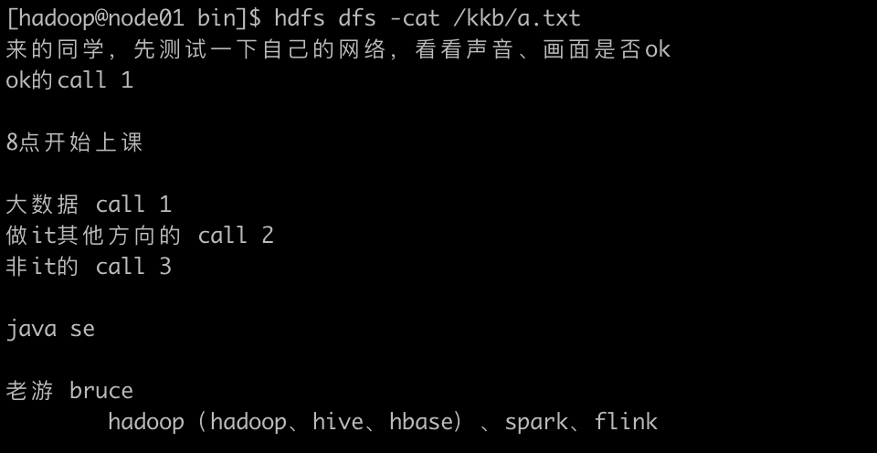

# HDFS分布式文件系统学习笔记

## Hadoop简史

Hadoop项目起源于Nutch，后者的设计目标是大型的全网搜索引擎。在开发的过程中很快凸显了2个问题，一个是如何对海量文件进行存储；另一个是如何对这么多文件计算索引。谷歌发表了两篇论文，一篇介绍分布式文件系统，一篇介绍分布式计算的MR模型，提供了解决方案，Hadoop的基础就是这两者的开源实现。

Hadoop从0.x、1.x、2.x到现在的3.x，已经发展了多个版本。主要的架构模块有三个：HDFS、YARN和MapReduce。

## HDFS模块重要组件

HDFS模块包含三个重要组件：

1. NameNode：负责维护文件系统元数据信息
2. DataNode：以数据块形式存储的数据
3. SecondaryNameNode：协助NameNode进行元数据管理，特别是数据冷备份

Yarn包含两个重要组件：

1. ResourceManager：负责资源的分配和调度工作
2. NodeManager：负责具体的分布式计算任务

## 分块、副本和机架感知

HDFS是采用分块存储方式来存储文件的，比如300M的文件，会分成128M、128M和44M三个block块进行存储，每个block块默认有3个冗余备份，称为“三副本存储”，这是可以通过配置进行修改的。副本的存储策略是机架感知的，也就是说HDFS文件系统会将数据块分散到不同机架上进行冗余存储，提高数据容错性。抽象成数据块既简化了存储子系统的设计，又方便数据的冗余备份。一个文件可能比单个DataNode节点的容量都大，但通过抽象成数据块的方式进行存储，则提供了存储大文件的可能性。

|          |           NameNode            |          DataNode          |
| -------- | :---------------------------: | :------------------------: |
| 存什么？ |        文件系统元数据         |          文件内容          |
| 存哪里？ |             内存              |            磁盘            |
| 具体数据 | 文件、block，DataNode之间映射 | block id和本地文件映射关系 |

## 安全模式

安全模式是HDFS所处的一种特殊状态，一般发生在整个系统启动的时候。在安全模式下NameNode会从磁盘上读取fsimage文件和edits.log文件，加载到内存中进行合并，还原出分布式文件系统的元数据信息，此时文件系统只处理读请求，任何写操作都会失败。NameNode不会在fsimage中持久化block在系统中的具体位置，这个信息是DataNode负责维护的，因此它启动后需要等待DataNode重新上报这个信息，才能正常工作，当NameNode收集到99.9%的数据块的最小副本条件并等待30s后，就会退出安全模式。

## HDFS Shell与Java API操作

HDFS Shell命令与Linux Shell命令类似，可以举一反三地使用，要学会使用help查看帮助信息。HDFS的文件系统主要是用来存储文件，它虽然也提供类似Linux文件系统那样的访问权限管理，但并不会做太多限制。HDFS还可以通过Java API进行访问，其基本操作套路是：

* 创建Configuration对象，进行必要信息的配置
* 获取FileSystem对象
* 通过FileSystem对象进行各种操作

## 数据检查点冷备份原理

SecondaryNameNode的主要作用是协助NameNode进行数据的冷备份。每次HDFS文件系统收到写请求时，总是会先写edits.log，写成功后再更新内存中的文件系统元数据，日志文件用于保证事务，元数据用于响应后续的读文件操作。如果一直不停地写，edits.log就会变得非常大，系统重启后要从日志恢复出元数据耗时也比较长，所以 edits.log事实上是由多个文件分片组成的，且任一时间内只有一个文件分片正在写入日志，那么这么多文件分片是怎么形成的呢？这就要通过SecondaryNameNode的冷备份来实现了。

fsimage是存储在磁盘上的数据持久化检查点文件，用于在NN故障时结合edits.log对文件系统元数据进行快速恢复。触发冷备份数据持久化检查要满足下列任一条件：

1. 1个小时时间间隔
2. 日志分片文件已写入100w事务

此时SNN就会向NN发送请求，NN会回滚生成新的日志分片文件，后续的写操作都会向其中写入日志。SNN获取fsimage文件和edits.log文件，加载到自己的内存中，然后进行合并，生成新的fsimage文件，随后该文件会返回给NN，替换掉原来的文件，从而完成fsimage的更新。

## Hadoop运行模式

Hadoop有三种运行模式。第一种叫本地模式，不启动任何守护进程，所有程序都在一个JVM运行，该模式用于学习和开发阶段的调试；第二种叫伪分布式模式，所有的守护进程运行在一台机器上；第三种叫完全分布式模式，即集群模式。可以结合vagrant启动3节点的CentOS虚拟机，模拟一个小的集群用于学习大数据开发。

## HDFS的适用场景

HDFS适合GB、TB和PB级大规模数据处理；HDFS适合流式数据访问，特别是读多写少的场景，一次写入，多次读取；HDFS可以构建在廉价机器上，通过多副本机制和机架感知提高可靠性。HDFS不适合低延时的数据访问场景，特别是毫秒级，但适合高吞吐场景；HDFS无法对大量小文件进行存储，因为每个文件都要存储元数据信息，大量小文件产生的元数据会占用磁盘空间；HDFS不支持并发写入和文件随机修改，一个文件只有一个线程写，且只支持数据追加。

## HDFS读写流程

### 读流程



1. client调用FileSystem::open()函数打开文件，该函数会进一步调用DistributedFileSystem::open()
2. 后者通过RPC调用与NameNode通信，获取该文件前几个block块的位置，以存储了block块的DataNode地址列表的形式返回，且按照离client距离由近及远排序
   * DistributedFileSystem返回的FSDataInputStream是DFSInputStream的Wrapper，用于读取数据
3. client在FSDataInputStream上调用read()，后者连接到最近的一个DataNode开始读取第一个block块
4. 数据源源不断从最近的DataNode读取到client
5. 读完第一个block块后关闭连接，然后和另一个DataNode建立连接并继续读取下一个block块，这个切换的过程对client是透明的，它感觉不到
6. 全部读取完毕后client关闭FSDataInputStream
   * 如果和DataNode通信出现错误，FSDataInputStream会尝试获取下一个最近的DataNode，它会记录出错的DataNode，在之后的读取操作中直接忽略掉它们。FSDataInputStream在读取过程中会检查block块的校验和，如果发现block块损坏则从另一个DataNode读取副本，然后把损坏的block块报告给NameNode

client在NameNode的引导下直接与不同的DataNode建立连接读取数据，使得HDFS能够支撑大规模并发读操作，而NameNode本身不会成为性能瓶颈。

### 写流程



1. client调用DistributedFileSystem::create()方法创建文件
2. DistributedFileSystem通过RPC通信向NameNode请求在命名空间中创建文件，但不包含block数据块
   * NameNode会做各种必要检查，比如要写入的文件不存在，client有权限创建文件，若检查失败会抛出IOException异常
3. 创建成功后DistributedFileSystem返回FSDataOutputStream用于数据写入操作，它是DFSOutputStream的Wrapper，写入数据时FSDataOutputStream会将数据拆分成一个一个的packet放入data queue，随后按顺序写入到多个DataNode组成的pipeline中
4. pipeline中的第一个DataNode收到packet后写入第二个DataNode，第二个写入到第三个，被写入的packet会放到ack queue中等待确认
5. 每写成功一个packet就进行数据校验，并返回ack packet，FSDataOutputStream收到确认后将对应的packet从ack queue中删除
   * 写入过程中如果出现DataNode故障，则会先关闭掉pipeline，所有ack queue中的packet全部放回data queue重新发送。发生故障的DataNode会从pipeline上删除，剩下的DataNode组成新的pipeline。剩余的block数据块会继续在pipeline中写入
6. 文件全部写入完毕后client关闭FSDataOutputStream，剩余还在data queue上的packet会被刷写到DataNode的pipeline
7. DistributedFileSystem与NameNode通信，告知写入操作结束。NameNode等待block块满足最小副本数量就成功返回

## 习题及解答

### 1. 本地开发环境配置

我使用的是Mac Book笔记本，采用的是MacOS操作系统，它本质上是一个Unix系统，故不需要进行配置。只需要安装Java、Intellij IDEA和maven就可以使用了。

### 2. 编程实现创建hdfs的/kkb/目录，并上传文件a.txt到此目录

```java
Configuration conf = new Configuration();
conf.set("fs.defaultFS", "hdfs://node01:8020");
FileSystem fs = FileSystem.get(conf);
Path src = new Path("file:///Users/likejun/become-bigdata-engineer/hadoop/hdfs/a.txt");
Path dst = new Path("/kkb/a.txt");
fs.copyFromLocalFile(src, dst);
fs.close();
```

运行结果截图：

