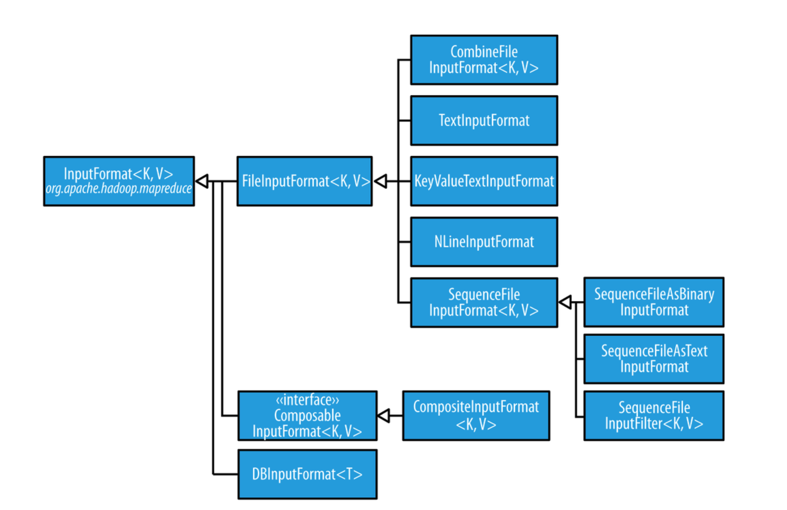
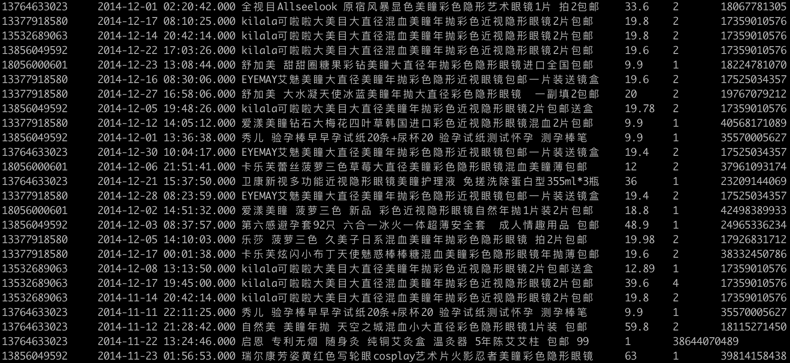
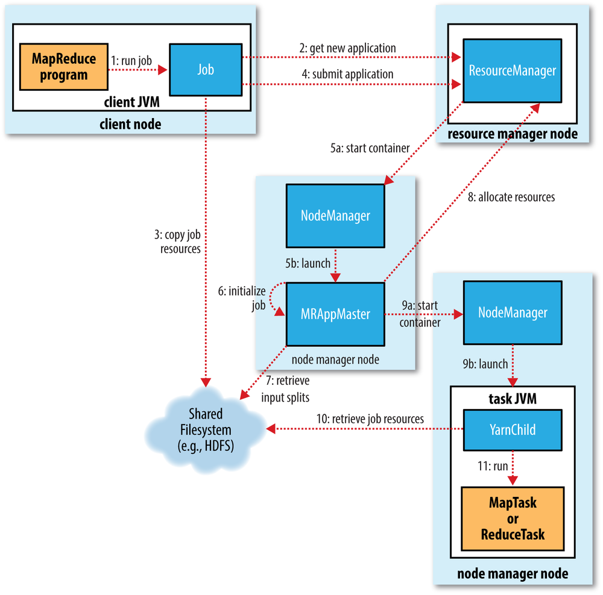

# MapReduce分布式计算框架学习笔记

## MapReduce编程模型简介

MapReduce分布式计算框架将Map-Reduce的计算模型和用户定义的业务逻辑相结合的计算框架，属于分布式计算模型的第一代。写好的MR程序直接运行在Hadoop集群上，其计算资源由YARN进行分配，并采取“计算跟着数据走”的模式。MapReduce的核心思想是“分而治之”，一个大的计算任务单机无法完成，于是就将它拆成一个一个的子任务交给集群的计算机去运行，每个节点得到一部分结果（Map阶段），然后将所有的结果汇总进行最后的计算并输出（Reduce阶段）。

Map阶段的计算由用户自定义的Mapper完成，其关键函数为map()函数，该函数将输入的键值对映射成输出的键值对。输出结果会暂时写入本地磁盘；Reduce阶段由用户定义的Reducer完成，其关键函数为reduce()函数，该函数将输入的键值对映射成相同键对应的一组值，输出结果会写入分布式文件系统（即HDFS）。Map和Reduce阶段的键值映射关系如下：

* Map Task：(K1, V1) --> (K2, V2)
* Reduce Task：(K2, V2) --> (K2, list(V1, V2 ... Vn))

## MapReduce计算步骤记忆诀窍

Map阶段有2个步骤，一个是数据通过InputFormat读入，形成数据分片（Split）输入给RecordReader。RecordReader类似一个迭代器，将分片中的数据按照一定的格式整理成键值对，对形成的每个键值对调用一次map()得到输出结果。Reduce阶段也有2个步骤，一个是对收集到的map()输出结果进行归并排序，然后调用reduce()逻辑，一个是将其输出写入到HDFS文件系统，都容易记忆。

关键要记忆的是中间的Shuffle阶段4个步骤：分区（Partition）-排序（Sort）-归约（Combine）-分组（Grouping），可以简记为PSCG。Map阶段的输出结果写入到本地磁盘之前会先按key**分区**，每个分区内按key**排序**，如果定义了combiner则会调用combiner进行**归约**，以减少写入磁盘的数据量和后续reduce操作的网络数据传输量，最后所有传输到reduce阶段的数据都会按key进行**分组**，每一个相同key所对应的value会放到同一组里形成一个集合，每组数据调用一次reduce()方法。

## Hadoop数据类型

Hadoop针对Java的基础数据类型定义了相对应的数据类型：

| Java类型 | Hadoop Writable类型 |
| -------- | ------------------- |
| Boolean  | BooleanWritable     |
| Byte     | ByteWritable        |
| Int      | IntWritable         |
| Float    | FloatWritable       |
| Long     | LongWritable        |
| Double   | DoubleWritable      |
| String   | Text                |
| Map      | MapWritable         |
| Array    | ArrayWritable       |
| byte[]   | BytesWritable       |

这些Writable类型都实现了WritableComparable泛型接口，该接口继承了Writable接口和Comparable泛型接口。

```java
@Public
@Stable
public interface Writable {
    void write(DataOutput var1) throws IOException;
    void readFields(DataInput var1) throws IOException;
}

public interface Comparable<T> {
  public int compareTo(T o);
}
```

Writable接口用于实现MapReduce自己的序列化和反序列化逻辑，Comparable接口用来实现比较逻辑，上述Hadoop数据类型都对基本数据类型实现了序列化和比较逻辑，如果是用户自定义的类作为key，则需要继承WritableComparable并自己实现上面这3个函数，且write()函数序列化的顺序必须和readFields()反序列化的顺序保持一致，另外自定义的类需提供一个无参构造函数。

## Hadoop编程入门

一个基本的MapReduce程序要实现3个部分的代码：定义mapper类，定义reducer类，组装main程序，都是有固定的套路可寻的。下面以最基本的单词统计程序来举例说明。

### 定义mapper类

定义mapper类要注意几个点。首先要继承Mapper泛型类，4个泛型类型要填入的数据分别是KEYIN、VALUEIN、KEYOUT和VALUEOUT，即输入输出的键值类型，这里输入的是文本文件，所以输入的key是LongWritable代表偏移量，输入的value为Text代表一行文本；输出的key为Text代表一个单词，输出的value为IntWritable代表单词的一次计数（为1）。另外，不要在map()函数中反复创建各种Writable对象，可以节约内存开销。

```java
public class WordCountMapper extends Mapper<LongWritable, Text, Text, IntWritable> {
    private Text wordText = new Text();
    private final IntWritable VALUE = new IntWritable(1);

    @Override
    protected void map(LongWritable key, Text value, Context context) throws IOException, InterruptedException {
        String[] words = value.toString().split("#");
        for (String word : words) {
            wordText.set(word);
            context.write(wordText, VALUE);
        }
    }
}
```

### 定义reducer类

定义Reducer类首先要集成Reducer泛型类，同样4个泛型类型要填入的数据分别是KEYIN、VALUEIN、KEYOUT和VALUEOUT，即输入输出的键值类型。其中输入的键值类型上接Mapper的输出键值类型；输出的键值类型为最终写入HDFS的输出结果键值类型，可以根据实际所遇到的计算任务将输出的值类型定义为NullWritable，即空类型，而所有的信息通过键来输出（可以利用MR计算框架对key进行排序来实现一些特殊需求）。

```java
public class WordCountReducer extends Reducer<Text, IntWritable, Text, IntWritable> {
    @Override
    protected void reduce(Text key, Iterable<IntWritable> values, Context context) throws IOException, InterruptedException {
        int sum = 0;
        for (IntWritable value : values) {
            sum += value.get();
        }
        context.write(key, new IntWritable(sum));
    }
}
```

### 组装main程序

基本套路都是继承一下Configured类，然后实现一下Tool接口。核心逻辑大同小异：

* 获取Configuration对象，创建Job实例
* 可以判断一下输出目录是否存在，然后删除
* Job::setJarByClass()
* 设置InputFormat并添加输入文件
* 设置Mapper及Mapper的输出键值类型
* 设置Reducer及最终输出的键值对
* 设置OutputFormat并添加输出文件
* 设置Reduce Task个数（可选）
* 提交任务

```java
public class WordCount extends Configured implements Tool {
    public static void main(String[] args) throws Exception {
        if (args.length != 2) {
            System.err.println("Usage: WordCount <input path> <output path>");
            System.exit(1);
        }

        Configuration conf = new Configuration();
        System.exit(ToolRunner.run(conf, new WordCount(), args));

    }

    @Override
    public int run(String[] args) throws Exception {
        Configuration conf = super.getConf();
        Job job = Job.getInstance(conf, "WordCounter");
        job.setJarByClass(WordCount.class);

        FileSystem fs = FileSystem.get(conf);
        if (fs.exists(new Path(args[1]))) {
            fs.delete(new Path(args[1]),true);
        }

        job.setInputFormatClass(TextInputFormat.class);
        TextInputFormat.addInputPath(job, new Path(args[0]));

        job.setMapperClass(WordCountMapper.class);
        job.setMapOutputKeyClass(Text.class);
        job.setMapOutputValueClass(IntWritable.class);


        job.setReducerClass(WordCountReducer.class);
        job.setOutputKeyClass(Text.class);
        job.setOutputValueClass(IntWritable.class);

        job.setOutputFormatClass(TextOutputFormat.class);
        TextOutputFormat.setOutputPath(job, new Path(args[1]));

        job.setNumReduceTasks(3);

        return job.waitForCompletion(true) ? 0 : 1;
    }
}
```

## 默认的MapReduce作业如何执行

如果一个MR作业只指定了输入文件路径和输出文件路径，最终的执行结果是什么？

```java
public class MinimalMapReduce extends Configured implements Tool {
  
  @Override
  public int run(String[] args) throws Exception {
    if (args.length != 2) {
      System.err.printf("Usage: %s [generic options] <input> <output>\n",
          getClass().getSimpleName());
      ToolRunner.printGenericCommandUsage(System.err);
      return -1;
    }
    
    Job job = new Job(getConf());
    job.setJarByClass(getClass());
    FileInputFormat.addInputPath(job, new Path(args[0]));
    FileOutputFormat.setOutputPath(job, new Path(args[1]));
    return job.waitForCompletion(true) ? 0 : 1;
  }
  
  public static void main(String[] args) throws Exception {
    int exitCode = ToolRunner.run(new MinimalMapReduce(), args);
    System.exit(exitCode);
  }
}
```

* InputFormat默认使用TextInputFormat，以LongWritable为key，Text为value
* 默认Mapper会原封不动输出键值对
* 默认Paritioner为HashPartitioner，用key的hash值模reduce task数量进行分区，有多少个reduce task就有多少个分区
* 默认Reducer会原封不动输出键值对，reduce前会对记录进行排序
* OutputFormat默认为TextOutputFormat

## InputFormat实现原理



InputFormat负责将输入文件转换为InputSplit数据分片，然后将其分解为Record。比如DBInputFormat，数据分片相当于数据库表中的多行数据，Record对应其一行数据。

```java
@Public
@Stable
public abstract class InputFormat<K, V> {
    public InputFormat() {
    }

    public abstract List<InputSplit> getSplits(JobContext var1) throws IOException, InterruptedException;

    public abstract RecordReader<K, V> createRecordReader(InputSplit var1, TaskAttemptContext var2) throws IOException, InterruptedException;
}
```

getSplits()函数通过数据所在位置调度集群上的运算；createRecordReader()负责创建处理分片的RecordReader，RecordReader将数据分片转换成一个一个的Record，对每个Record调用map()函数逻辑。每一个分片数据用InputSplit表示，getLength()函数返回数据分片大小（单位：字节），getLocations()函数返回数据所在DataNode的地址列表。所以InputSplit并不包哈安数据，只包含对数据的引用，最大的分片最优先处理。

```java
public abstract class InputSplit {
    public InputSplit() {
    }

    public abstract long getLength() throws IOException, InterruptedException;

    public abstract String[] getLocations() throws IOException, InterruptedException;

    @Evolving
    public SplitLocationInfo[] getLocationInfo() throws IOException {
        return null;
    }
}
```

数据分片大小的计算公式为`splitSize = max(minSize, min(blockSize, maxSize))`，因此把minSize调大，会导致分片变大，相应的MapTask数量就减少；把maxSize调小，分片变小，相应的MapTask数量就会增加。

## MapReduce的Partitioner

MapReduce作业默认按key对结果进行分区，相同key的结果会被分配到同一个区中。系统默认的分区器为HashPartitioner，它以key的hash值来进行分区，且使用numReduceTasks取模，有多少个Reduce Task就有多少个分区。

```java
public class HashPartitioner<K, V> extends Partitioner<K, V> {
    public HashPartitioner() {
    }

    public int getPartition(K key, V value, int numReduceTasks) {
        return (key.hashCode() & Integer.MAX_VALUE) % numReduceTasks;
    }
}
```

如果我们要设计将某些具有共同特征的数据存放到同一个分区中，或者调整数据倾斜，就需要自定义Partitioner，例如统计单词时将特定单词发往特定分区。

```java
public class WordCountPartitioner extends Partitioner<Text, IntWritable> {
  private static Map<String, Integer> dict = new HashMap<>();

  static {
  	dict.put("Dear", 0);
    dict.put("Bear", 1);
    dict.put("River", 2);
    dict.put("Car", 3);
  }

  @Override
  public int getPartition(Text text, IntWritable intWritable, int i) {
  	return dict.get(text.toString());
  }
}
```

## Combiner归约运算

Combiner本质上是运行在Map阶段的Reducer，它的作用主要是在Map阶段提前进行归约操作然后再将结果写入磁盘，这么做的好处是加快速度。一方面是减少写入磁盘的数据量，另一方面是减少Reduce阶段网络传输的数据量。但**一定要注意**，不是所有的操作都适合使用Combiner，一个重要的原则是Combiner不能改变最终结果，比如求平均值就不适合用归约运算。

## WritableComparable和WritableComparator

MapReduce框架默认在进行reduce处理前会对key进行排序的，无论业务逻辑需不需要，而value的顺序却不保证，这一点一定要牢记，因为掌握了这个规律能够让我们编写一些复杂场景下的计算程序。WritableComparator类继承了RawComparator接口，它重载了compare()方法，其中最重要的两个compare()重载方法如下：

```java
public class WritableComparator implements RawComparator, Configurable {
  //...
  public int compare(byte[] b1, int s1, int l1, byte[] b2, int s2, int l2) {
    try {
      this.buffer.reset(b1, s1, l1);
      this.key1.readFields(this.buffer);
      this.buffer.reset(b2, s2, l2);
      this.key2.readFields(this.buffer);
      this.buffer.reset((byte[])null, 0, 0);
    } catch (IOException var8) {
      throw new RuntimeException(var8);
    }

    return this.compare(this.key1, this.key2);
  }

  public int compare(WritableComparable a, WritableComparable b) {
    return a.compareTo(b);
  }
}
```

第一个compare()方法直接对序列化后的字节流进行比较，避免了反序列化及创建对象的开销；而第二个compare()方法则直接调用WritableComparable对象的compareTo()方法进行比较，通过阅读源代码我们弄清楚了这两个类之间是如何协作的。这样我们就可以编写多个WritableComparator类，重载其compare(WritableComparable a, WritableComparable b)方法来实现不同的排序和分组策略。

## 复杂案例：分组求TopN



现有一份淘宝用户的订单历史记录文件，该文件每一行表示一条用户数据，包含以下信息：

* 用户ID：userid
* 订单的日期和时间：datetime
* 商品标题：title
* 商品单价：unitPrice
* 购买量：purchaseNum
* 商品ID：productId

需求是输出每个用户每月消费最多的2笔订单，从高到低排列。仔细分析需求发现要得到想要的结果，有分组也有排序。要按用户ID和月份进行分组，之后求出每一组中总金额最大的两笔订单。输出结果可以包含3部分信息：“用户ID”、“年月”和“商品总价”。MapReduce只会对key进行排序，看上去我们要让输出的记录按“用户ID”升序，然后按“年月”升序，最后按“商品总价”降序，这种复合排序被称为“二次排序”，普通的key肯定无法满足这个需求，只能自定义类作为key，这里将整个订单数据设计为key，注意这里的compareTo()函数直接返回0，因为我们不需要在这里实现这个业务逻辑，相关业务逻辑通过重载WritableComparator来实现：

```java
public class UserOrder implements WritableComparable<UserOrder> {
    private String userID;
    private String yearMonth;
    private String title;
    private double unitPrice;
    private int purchaseNum;
    private String productID;

    public UserOrder(String userID, String yearMonth, String title, double unitPrice, int purchaseNum, String productID) {
        this.userID = userID;
        this.yearMonth = yearMonth;
        this.title = title;
        this.unitPrice = unitPrice;
        this.purchaseNum = purchaseNum;
        this.productID = productID;
    }

    public UserOrder() {}

    @Override
    public int compareTo(UserOrder o) {
        return 0;
    }

    @Override
    public String toString() {
        return String.format("%s\t%s\t%s\t%.2f\t%d\t%s",
                userID, yearMonth, title, unitPrice, purchaseNum, productID);
    }

    @Override
    public void write(DataOutput dataOutput) throws IOException {
        dataOutput.writeUTF(userID);
        dataOutput.writeUTF(yearMonth);
        dataOutput.writeUTF(title);
        dataOutput.writeDouble(unitPrice);
        dataOutput.writeInt(purchaseNum);
        dataOutput.writeUTF(productID);
    }

    @Override
    public void readFields(DataInput dataInput) throws IOException {
        setUserID(dataInput.readUTF());
        setYearMonth(dataInput.readUTF());
        setTitle(dataInput.readUTF());
        setUnitPrice(dataInput.readDouble());
        setPurchaseNum(dataInput.readInt());
        setProductID(dataInput.readUTF());
    }

    public String getUserID() {
        return userID;
    }

    public void setUserID(String userID) {
        this.userID = userID;
    }

    public String getYearMonth() {
        return yearMonth;
    }

    public void setYearMonth(String yearMonth) {
        this.yearMonth = yearMonth;
    }

    public String getTitle() {
        return title;
    }

    public void setTitle(String title) {
        this.title = title;
    }

    public double getUnitPrice() {
        return unitPrice;
    }

    public void setUnitPrice(double unitPrice) {
        this.unitPrice = unitPrice;
    }

    public int getPurchaseNum() {
        return purchaseNum;
    }

    public void setPurchaseNum(int purchaseNum) {
        this.purchaseNum = purchaseNum;
    }

    public String getProductID() {
        return productID;
    }

    public void setProductID(String productID) {
        this.productID = productID;
    }
}
```

MapReduce默认的分区器是获取key的哈希值进行分区的，我们这里自定义类作为分区，肯定不能使用这样的逻辑，而是应该按“用户ID”进行分区，把相同用户ID的记录放到一个分区中，不能打散存放，这样才能获取Top 2的值，所以第二步是自定义分区器：

```java
public static class CustomPartitioner extends Partitioner<UserOrder, DoubleWritable> {
	@Override
  public int getPartition(UserOrder userOrder, DoubleWritable doubleWritable, int numReduceTasks) {
    return (userOrder.getUserID().hashCode() & Integer.MAX_VALUE) % numReduceTasks;
  }
}
```

分区之后是排序，排序也是默认按key来进行的，但这里我们需要按“用户ID”升序，如果“用户ID”相同则按“年月”升序，如果“年月”相同则再按订单总金额降序，因此这里需要实现一个用于排序的Comparator：

```java
public static class CustomSortComparator extends WritableComparator {
  // 必须有这个构造函数，否则会抛空指针异常
	protected CustomSortComparator() {
  	super(UserOrder.class, true);
  }

  @Override
  public int compare(WritableComparable a, WritableComparable b) {
  	UserOrder order1 = (UserOrder)a;
    UserOrder order2 = (UserOrder)b;

    int ret = order1.getUserID().compareTo(order2.getUserID());
    if (ret != 0) return ret;
    
		ret = order1.getYearMonth().compareTo(order2.getYearMonth());
    if (ret != 0) return ret;
    
    Double price1 = order1.getUnitPrice() * order1.getPurchaseNum();
    Double price2 = order2.getUnitPrice() * order2.getPurchaseNum();
    return -price1.compareTo(price2);
  }
}
```

排序之后是分组，分组默认是按key来进行的，这里我们需要订单数据按“用户ID”和“年月”相同的分成一组。

```java
public static class CustomGroupComparator extends WritableComparator {
	protected CustomGroupComparator() {
  	super(UserOrder.class, true);
  }

  @Override
  public int compare(WritableComparable a, WritableComparable b) {
  	UserOrder order1 = (UserOrder)a;
    UserOrder order2 = (UserOrder)b;

    int ret = order1.getUserID().compareTo(order2.getUserID());
    if (ret == 0) {
    	return order1.getYearMonth().compareTo(order2.getYearMonth());
    }
    return ret;
  }
}
```

剩下的就是自定义Mapper和Reducer，然后组装main程序了：

```java
public class CustomGroupDemo extends Configured implements Tool {
    @Override
    public int run(String[] args) throws Exception {
        Configuration conf = super.getConf();
        Job job = Job.getInstance(conf, CustomGroupDemo.class.getSimpleName());
        job.setJarByClass(CustomGroupDemo.class);

        job.setInputFormatClass(TextInputFormat.class);
        TextInputFormat.addInputPath(job, new Path(args[0]));

        job.setMapperClass(CustomGroupMapper.class);
        job.setMapOutputKeyClass(UserOrder.class);
        job.setMapOutputValueClass(DoubleWritable.class);

        job.setReducerClass(CustomGroupReducer.class);
        job.setOutputKeyClass(Text.class);
        job.setOutputValueClass(DoubleWritable.class);
        job.setPartitionerClass(CustomPartitioner.class);
        job.setSortComparatorClass(CustomSortComparator.class);
        job.setGroupingComparatorClass(CustomGroupComparator.class);

        job.setOutputFormatClass(TextOutputFormat.class);
        TextOutputFormat.setOutputPath(job, new Path(args[1]));

        return job.waitForCompletion(true) ? 0 : 1;
    }

    public static void main(String[] args) throws Exception {
        Configuration conf = new Configuration();
        System.exit(ToolRunner.run(conf, new CustomGroupDemo(), args));
    }

    public static class CustomGroupMapper extends Mapper<LongWritable, Text, UserOrder, DoubleWritable> {
        private DoubleWritable totalPrice = new DoubleWritable();
        @Override
        protected void map(LongWritable key, Text value, Context context)
                throws IOException, InterruptedException {
            String[] fields = value.toString().split("\t");
            if (fields.length == 6) {
                String userID = fields[0];
                String yearMonth = getYearMonthString(fields[1]);
                if (yearMonth != "") {
                    String title = fields[2];
                    double unitPrice = Double.parseDouble(fields[3]);
                    int purchaseNum = Integer.parseInt(fields[4]);
                    String productID = fields[5];

                    UserOrder order = new UserOrder(userID, yearMonth, title, unitPrice, purchaseNum, productID);
                    totalPrice.set(unitPrice * purchaseNum);
                    context.write(order, totalPrice);
                }
            }

        }

        public String getYearMonthString(String dateTime) {
            DateTimeFormatter formatter = DateTimeFormatter.ofPattern("yyyy-MM-dd HH:mm:ss.SSS");
            try {
                LocalDateTime localDateTime = LocalDateTime.parse(dateTime, formatter);
                int year = localDateTime.getYear();
                int month = localDateTime.getMonthValue();
                return year + "" + month;
            } catch (DateTimeParseException ex) {
                System.out.println(ex);
                return "";
            }
        }
    }

    public static class CustomGroupReducer extends Reducer<UserOrder, DoubleWritable, Text, DoubleWritable> {
        private Text textKey = new Text();
        @Override
        protected void reduce(UserOrder key, Iterable<DoubleWritable> values, Context context) throws IOException, InterruptedException {
            int num = 0;
            for (DoubleWritable doubleWritable : values) {
                textKey.set(key.getUserID() + " " + key.getYearMonth());
                context.write(textKey, doubleWritable);
                num++;
                if (num >= 2) {
                    break;
                }
            }
        }
    }
}
```

## MapReduce框架工作机制



### 工作原理

#### Job提交

Step1：Job::submit()创建JobSubmitter实例，调用函数submitJobInternal()，然后调用waitForCompletion()不断更新执行进度，执行成功返回统计结果，执行失败返回错误，所有信息都返回到控制台。

Step2：JobSubmitter向ResourceManager申请新的Application ID作为Job ID。检查输出位置是否正确，如果输出目录未指定或者已存在，则报错；根据输入文件计算输入的数据分片，若无法成功计算，则报错。

Step3：拷贝计算所需资源到HDFS指定目录中（以Job ID命名），包括Jar包、配置文件和计算好的分片，其中Jar包会拷贝很多副本供NodeManager访问。

Step4：调用submitApplication()提交job。

#### Job初始化

Step5：ResourceManager收到submitApplication()调用，将请求转发给YARN scheduler，后者分配一个容器，ResourceManager在容器中启动AppMaster，容器由NodeManager负责管理。

Step6：MRAppMaster创建一系列统计对象来追踪job进度，主要是各种task的进度，完成初始化工作。

Step7：MRAppMaster从HDFS获取client在提交阶段计算好的输入分片，针对每个分片创建一个Map Task，同时创建多个Reduce Task。每个Task有一个ID，在任何Task运行前MRAppMaster会调用OutputCommitter::setupJob()，比如默认的FileOutputComitter会创建输出目录以及与Task输出有关的临时工作空间。

#### Task分配

Step8：MRAppMaster向ResourceManager请求为所有的Map和Reduce Task分配容器，并分配内存和CPU等资源。会优先为Map Task申请分配容器。Reduce Task可以在集群任一机器运行，但Map Task要满足一定的数据局部性限制，最好的情况是Map Task直接运行在有数据分片的机器上；次一级是运行在同一机架其他节点上；最次是需要从有数据的节点上传输数据。

#### Task执行

Step9：一旦ResourceManager分配到某节点上运行Task所需的容器资源，MRAppMaster就会与NodeManager通信启动容器。

Step10：Task由YarnChild的Java应用负责执行，执行前YarnChild会收集所有Task执行所需资源（job配置、jar包和分布式缓存中的文件）

Step11：YarnChild执行Map Task或Reduce Task。YarnChild运行在专门的JVM中，用户定义的map和reduce逻辑中出现的bug就不会对NodeManager造成影响，导致崩溃。

#### 进度状态更新

运行中的Task会追踪自己的进度。Map会统计已处理的输入比例；Reduce则按shuffle的阶段来统计。Task使用Counter进行统计，Counter可以自定义。Task会不断将状态上报给MRAppMaster。

#### Job执行完毕

MRAppMaster收到最后一个Task的完成通知，即标记job状态为“成功”。job从waitForCompletion()返回相关统计计数打印到控制台。MRAppMaster和Task容器清理工作状态，删除中间结果，调用OutputCommitter::commitJob()将job信息上报History Server。

### Shuffle原理

#### MapTask工作机制

每个Map Task都向其内存中的环形缓冲区写入输出结果，当缓冲区满80%（可配置）即触发刷写机制，由另一个后台线程写数据到磁盘，刷写是以round-robin的方式写入相关子目录的。

刷写到磁盘前，会对map输出的数据进行分区，每个分区对应一个Reduce Task。后台线程会对每个分区数据进行内存排序。如果有combiner，则进行归约处理，得到更紧凑的map输出结果，减少磁盘写入量并节约传输带宽。

每次环形缓冲触发阈值导致的磁盘刷写都会生成一个新的文件，Task结束前所有的刷写文件都会被归并成一个单独的、已分区已排序的输出文件。

如果有至少3个刷写文件，combiner就会在最后生成输出文件前再次运行。已分区已排序的输出文件会按分区通过HTTP传输给不同的Reducer，进入Reduce Task阶段。

#### ReduceTask工作机制

map输出结果存放在运行Map Task节点的本地磁盘上，Reduce Task需要从集群中多个运行Map Task的节点上获取所需某个分区数据，每个Reduce Task都有几个拷贝线程，一旦完成就马上执行拷贝，这个阶段被称为“Copy Phase”。

如果map输出结果足够小则放入Reduce Task的JVM内存中，否则就拷贝到磁盘上。内存缓冲区达到阈值也会将数据归并和刷写到磁盘上（数据大小或map输出数据达到阈值），归并时会再次运行combiner来减少写入磁盘数据量。

数据拷贝在磁盘中不断累积的同时，后台线程会不断将其归并成几个大的、已排序的文件，为后面的“Sort Phase”节约时间。

全部map输出拷贝完毕后会进入“Sort Phase”阶段，对map输出结果进行归并排序，这个过程是一轮一轮进行的，比如50个结果进行归并，每轮10个，则会产生5个中间结果文件。

这5个中间文件会直接作为输出进入“Reduce Phase”阶段，在最后一个阶段中处理内存-磁盘混合归并。在这个阶段中每一个key都会调用一次reduce()函数。这个阶段的输出直接写入HDFS文件系统。


