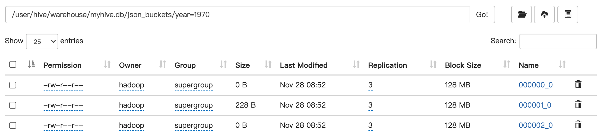

# Hive数据仓库

## 知识点

### 1. 数据仓库通识

数据仓库用于面向分析的应用场景，为企业决策提供支持。它出于分析性报告和决策支持的目的构建，作为仓库，它本身不产生数据，也不消费数据，只存储数据。

数据仓库主要特征：

* 面向主题
* 集成的
* 非易失的
* 时变的

数据仓库和数据库分别对应OLAP和OLTP场景：

1. 数据库是面向事务的设计，数据仓库是面向主题的设计
2. 数据库一般存储业务数据，数据仓库存储历史数据
3. 数据库的表结构设计要引入三范式，尽量避免冗余，一般针对某一业务应用进行设计
4. 数据仓库在设计时是反范式的，要引入冗余，有特定的设计技巧
5. 数据库是为了捕获数据而设计，数据仓库是为了分析数据而设计

数据仓库以分层架构的思想进行设计，分为源数据层（ODS）、数据仓库层（DW）和数据应用层（DA）。源数据层对数据无任何更改，直接沿用外围系统数据结构和数据，作为临时存储层且不对外开放，为后一步数据处理做准备；数据仓库层也称为细节层，该层数据是一致的、准确的、干净的，即对源系统数据进行了清洗；数据应用层作为前端应用直接读取的数据源使用，根据相关报表和专题分析的需求计算生成。

### 2. Hive

Hive是基于Hadoop的数据仓库工具。可以将结构化的数据文件（例如CSV）转换成数据库表，提供类SQL查询功能。其基本原理是将SQL语句转换成MapReduce程序进行计算。Hive适用于海量离线数据统计分析应用场景。

重点：

1. Hive核心概念、与数据库的区别
2. 架构原理
3. 交互方式
4. 数据类型
5. Hive的DDL语法操作，内部表和外部表区别
6. Hive分区表，静态分区和动态分区
7. Hive分桶表的原理和作用
8. Hive数据导入和导出
9. Hive查询语法
10. Hive参数传递
11. Hive常用函数，如何自定义函数，各种UDF和分析函数的使用
12. Hive表的数据压缩和各种存储格式
13. 性能调优小技巧

## 思考题

1. 完成课件中外部分区表score4的操作，并说明为什么最后需要执行msck repair table score4

答：score4表的操作主要考察两个知识点，一个是分区表的概念，一个是外部表的概念。创建表之后是空的，需要把表和数据之间建立关联，故需要使用`msck repair table score4`将数据和表关联起来，这样才能从表中查询数据进行分析。

2. 有原始json数据格式内容如下

```json
{"movie":"1193","rate":"5","timeStamp":"978300760","uid":"1"} 
{"movie":"661","rate":"3","timeStamp":"978302109","uid":"1"}
{"movie":"914","rate":"3","timeStamp":"978301968","uid":"1"}
{"movie":"3408","rate":"4","timeStamp":"978300275","uid":"1"}
{"movie":"2355","rate":"5","timeStamp":"978824291","uid":"1"}
{"movie":"1197","rate":"3","timeStamp":"978302268","uid":"1"}
{"movie":"1287","rate":"5","timeStamp":"978302039","uid":"1"}
```

（1）创建hive表，加载数据，使用自定义函数来解析json格式的数据，最后得到如下结果：

| movie | rate |        timestamp        | uid  |
| :---: | :--: | :---------------------: | :--: |
| 1193  |  5   | 1970-01-12 07:45:00.76  |  1   |
|  661  |  3   | 1970-01-12 07:45:02.109 |  1   |
|  914  |  3   | 1970-01-12 07:45:01.968 |  1   |
| 3408  |  4   | 1970-01-12 07:45:00.275 |  1   |
| 2355  |  5   | 1970-01-12 07:53:44.291 |  1   |
| 1197  |  3   | 1970-01-12 07:45:02.268 |  1   |
| 1287  |  5   | 1970-01-12 07:45:02.039 |  1   |

（2）对表进行查询，然后把查询结果导入到本地文件中

（3）根据上表创建一张既分区又分桶的hive外部分区表，从上表中查询数据，动态插入到指定分区，最后在浏览器查看其文件列表

参考答案如下：

（1）创建数据文件并上传到HDFS

```shell
vi json_data
hdfs dfs -mkdir /json_demo
hdfs dfs -put json_data /json_demo
```

（2）创建原始数据表并加载数据到表中

```sql
CREATE EXTERNAL TABLE IF NOT EXISTS myhive.json_original(data string) 
STORED AS textfile location '/json_demo/';
```

```shell
select * from json_original;
OK
json_original.data
{"movie":"1193","rate":"5","timeStamp":"978300760","uid":"1"}
{"movie":"661","rate":"3","timeStamp":"978302109","uid":"1"}
{"movie":"914","rate":"3","timeStamp":"978301968","uid":"1"}
{"movie":"3408","rate":"4","timeStamp":"978300275","uid":"1"}
{"movie":"2355","rate":"5","timeStamp":"978824291","uid":"1"}
{"movie":"1197","rate":"3","timeStamp":"978302268","uid":"1"}
{"movie":"1287","rate":"5","timeStamp":"978302039","uid":"1"}
```

（3）解析原始数据表生成新表

```sql
CREATE TABLE json_parsed(movie int, rate int, `timestamp` timestamp, uid string) 
ROW FORMAT DELIMITED FIELDS TERMINATED BY ',' STORED AS textfile;
```

```sql
INSERT OVERWRITE TABLE json_parsed 
SELECT get_json_object(data, "$.movie") AS movie, 
get_json_object(data, "$.rate") AS rate, 
cast(get_json_object(data, "$.timeStamp") AS bigint) AS `timestamp`, 
get_json_object(data, "$.uid") AS uid 
FROM json_original;
```

（4）查询新表然后将查询结果写入到本地文件

```sql
insert overwrite local directory '/home/hadoop/hivedata/json_parsed' row format delimited fields terminated by ',' select * from json_parsed;
```

（5）创建既分区又分桶的hive外部分区表，查询数据动态插入指定分区

```sql
set hive.enforce.bucketing=true;
set mapreduce.job.reduces=3;

create table myhive.json_buckets(movie int, rate int, `timestamp` timestamp, uid string) partitioned by (year string) clustered by (uid) into 3 buckets row format delimited fields terminated by ',';

load data local inpath '/home/hadoop/hivedata/json_parsed/000000_0' into table json_buckets partition(year='1970');
```



3. snappy压缩的文件作为mr的输入，文件是否支持切分？如果hive表使用snappy算法进行压缩，如何保证以后对该表执行的HiveSQL语句转换成MR后能够开启多个MapTask？

Snappy压缩的文件是否支持切分，关键是看压缩前是什么格式文件，如果是TEXTFILE，是不支持压缩的；但SequenceFile和Avro等数据文件经过Snappy压缩后是可以分割的，因为比如SequenceFile中的block就是用Snappy进行压缩的，可以通过文件的元数据读取信息然后解压缩，分割到多个MapTask执行。